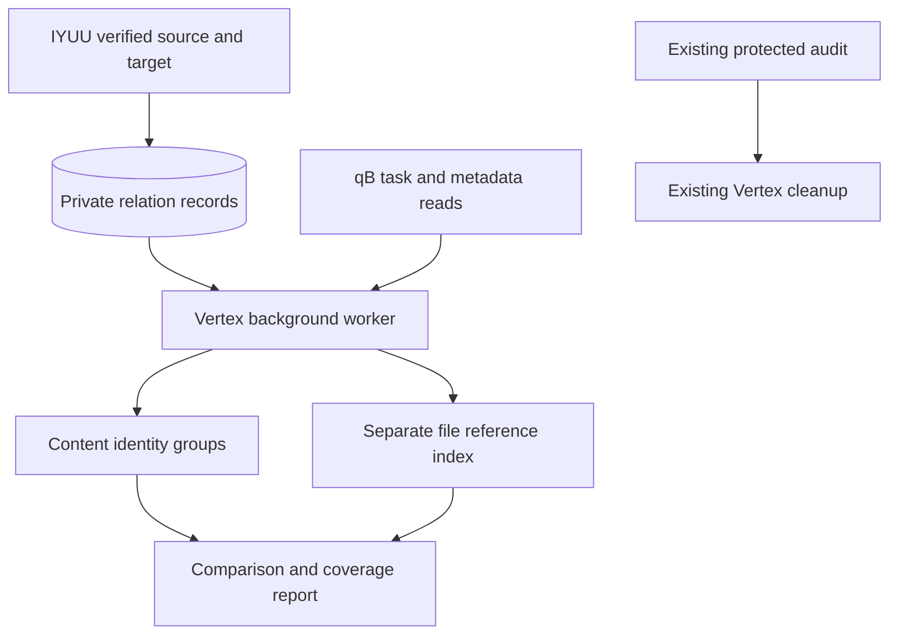

# Content groups: native shadow observation

_2026-10-07 — implemented first migration stage; not an active deletion engine._

## 🎯 Scope and status

The observer runs in a bounded worker inside Vertex. It does not introduce a daemon, Docker socket, site crawler, deletion executor or new database writer. Existing acquisition, H&R rules, fitTime, IYUU exit fences and cleanup execution are unchanged.

Implemented: strict v1 metadata identity, task-instance binding, content/mapping groups, a separate file-reference index, optional read-only filesystem audit, bounded qB collection, private cache/history and aggregate status in `listMainInfo`.

Not implemented in this stage: active cleanup using the new index, main-downloader physical namespace integration, physical disk/share capacity reconciliation, pending admission reservations, H&R/fence permission issuance, historic IYUU database import, or removal of the existing external auditor. The module only accepts `mode: shadow`; changing it to `active` cannot enable deletion.

## 🔗 Data flow



No connection from the shadow report to deletion is intentional, not a missing configuration toggle.

## 🔍 Identity and safety contract

- Compare the original torrent info bytes to qB's hash. Do not re-encode to calculate infohash.
- Content identity includes the ordered file paths/lengths, piece length and every v1 piece hash through a SHA256 digest. Tracker/source/private differences outside that identity do not split identical content.
- Group key also includes the selected downloader and its exact advertised file mapping. Copies under different save paths stay separate. The original can disappear without changing the content group ID; membership revision changes.
- File mapping here is qB metadata, **not proof of physical ownership**. Temp download directories, aliases, mixed layouts and other downloader namespaces require additional verification before active cleanup.
- Same parent directory, name, size, IYUU Success or group_id never proves identity. Partial overlap stays a safety relationship, not a yield/H&R group.
- Re-add timestamp, path, size or manifest changes invalidate a proof. Checking/moving/error states are unproved. Unsupported v2/hybrid, padding, selective downloads and renamed layouts fail closed; they are not paused or deleted.
- Cached manifests older than 660 seconds remain explicitly protected. Metadata identity stays cached to avoid a cold-cache loop on large clients. Cached reports are never final deletion checks.
- Yield observations use group membership revisions and per-member counters. Gaps, new members and counter resets restart the observation window; missing history is not zero yield. Old path-keyed history is not imported.
- The shadow reservation includes paused tasks and deduplicates only proved identities. It is a diagnostic estimate, not physical free space or admission authority; pending intents are explicitly absent.
- The optional filesystem audit only walks bounded directory/stat metadata and rejects extra files, missing files, symlinks, hardlinks, ambiguous mapping and overlapping task scopes. It does not hash file payload or grant deletion permission. Logical file sizes are not net freed GiB.

## ⚙️ Opt-in configuration

This is operator-only migration configuration, not a replacement for the user's selection or exit rules. No existing client is enabled automatically.

Add to **only the brushing downloader** after deployment approval:

```json
{
  "contentGroups": {
    "mode": "shadow",
    "roots": ["/downloads"],
    "maxTasks": 32,
    "intervalMs": 300000,
    "lineageDirectory": "/vertex/iyuu-lineage"
  }
}
```

Bounds: at most 64 inspected tasks per cycle, interval at least five minutes, 45-second worker deadline, five-second request deadline and six seconds reserved for final qB readback. Initial 32-task cycles need many rounds to cover a large client. Report sample coverage; never imply full validation after one cycle. A failed read cannot refresh a prior success timestamp.

The worker uses the existing downloader cookie in RAM and only GETs `torrents/info`, `torrents/files`, `torrents/export`. It sends no site requests, uses no torrent proxy settings and follows no redirects. It writes only `app/data/content-groups/<client-id>-shadow.json`, mode 0600; raw exports, URLs and cookies are not retained. Client status exposes aggregate counts only.

The companion authored IYUU hook lives in the private Devops project, not this public fork. Its optional `lineage` object contains `enabled`, the exact Vertex `clientKey` and a verified shared `readerGid`. It atomically writes one sanitized record per target under `/data/vertex-lineage`. Two `members` are ordered source then target. Records contain both task instances, content and manifest digests, proof type and verification time; they are not H&R or ownership permits. Writing failure logs only a fixed status and does not pause/recheck an already successful reseed.

IYUU owns this directory; Vertex needs a **read-only** bind mount. Use verified runtime UID/GID permissions (directory 2750, record 0640 when shared), not a writable IYUU database mount. With lineage disabled there is no new directory write or extra proof-read request.

Optional `fileMappings` entries have `qbitRoot` and `localRoot` and require separately approved read-only payload mounts. Leave empty for first rollout. At most four protected-scope-free groups are stat-audited per cycle; this partial coverage cannot replace the production auditor.

## ✅ Validation and rollout gates

Run `test/content-groups.js` in the deployed Node 14 runtime with a network-isolated local fixture container. Existing `reliability.js`, `providers.js` and `provider-http.js` remain required. PHP proof writer and finish-hook integration fixtures run locally without NAS assets, DB, real qB or site requests.

The bounded live preflight samples real qB metadata in RAM and executes the native identity engine locally. It does not create production fixtures or run payload scans. A successful sample validates only selected metadata identities, not filesystem ownership, H&R or a full-client migration.

Next release requires explicit approval for a Vertex rebuild, IYUU worker reload, private hook/config writes and a read-only lineage mount. Preserve existing qB, IYUU tasks, database history, API budgets, storage floors and old audit/cleanup chain. Do not run an old installer that injects canary torrents as a shortcut.

Before any subsequent active cutover, implement and verify: complete physical namespace/reference coverage (including read-only main downloader protection), IYUU fencing, current H&R gates, near-completion protection, group stability, pending/physical/share reservations, safe group transaction outcomes and final-reference file verification. Retire the host auditor only after that migration is proven.

## 🔄 Rollback

For this shadow stage, remove the opt-in `contentGroups` config and disable IYUU `lineage.enabled`, then restore the exact prior image/hook if required. Keep the old auditor and cleanup chain throughout. Shadow caches and relation records can remain inert; no cleanup operation is required for rollback. Never feed shadow state into the old audit reader.

No claim is made that reverting code restores files deleted by an active engine; this stage has no deletion capability.

## 🗄️ Database relation transport (opt-in)

The database transport replaces the relation-file handoff, not the existing cleanup engine. It remains shadow-only. The companion IYUU hook appends verified source/target proofs to two dedicated tables in its existing MariaDB database; Vertex only reads those tables. It does not infer relationships from historical `cn_reseed.status=Success` rows. No additional daemon or database server is required.

| Setting or bound | Database mode |
| --- | --- |
| Client configuration | `contentGroups.lineageSource: "database"` |
| Legacy mode | Omit `lineageSource`, or set `"file"`; existing behavior remains |
| Hook configuration | `lineage.transport: "database"`; file is the legacy default |
| Tables | `cn_vertex_lineage_stream`, `cn_vertex_lineage` |
| Vertex account | SELECT on exactly these two tables; no IYUU administrative credentials |
| Private connection file | `app/data/content-groups/<client-id>-lineage-db.json`, mode 0600, regular single-link file |
| Connection fields | `host`, integer `port`, `database`, `user`, `password`; optional trusted `ca` for TLS |
| Polling | 30 seconds; one worker per downloader, overlapping runs skipped |
| Event page | At most 128 ordered records per poll |
| qB metadata work | Existing `maxTasks`, default 32; no payload reads |
| Time bounds | DB connect 2 seconds, query 3 seconds, total DB read 10 seconds; whole worker 45 seconds |
| History | Counter continuity checked each snapshot; persisted samples at five-minute spacing |

Keep connection secrets out of client configuration, source control, UI responses and logs. Provision the connection file through the deployment secret channel; do not paste a credential-bearing example into documentation. The isolated `mysql2` dependency is pinned without replacing the official runtime's modules or SQLite ABI.[^db1]

The writer serializes event-ID allocation through commit with a named database lock. An auto-increment ID alone is not a commit-order cursor: a later ID could become visible before an earlier transaction commits. Duplicate proofs are idempotent. Vertex uses a read-only transaction, validates record digests and task-instance bindings, then atomically persists its cursor together with the accepted records and qB work queue. Failed state writes replay the page; no acknowledgment is written into IYUU. A changed stream epoch or missing cursor anchor reports an error instead of silently restarting at zero.[^db2]

The first task snapshot establishes a baseline, **not a historical backfill queue**. New/re-added/moved tasks, newly received relation members and stale already-known identities are maintained incrementally. Both source and target are scheduled when a proof arrives; a capped batch preserves unprocessed work. Historical identity backfill must use a separately reviewed one-time migration. This change does not implement that migration or guarantee full-client coverage within a fixed time.

Deployment must explicitly create and verify the schema before enabling the hook; it never runs DDL inside a reseed callback. Verify database connectivity and a SELECT-only account before enabling Vertex database mode. If the existing database listens only on loopback, network/listener changes require separate approval: do not publish a host database port or reuse root credentials. Keep the old relation files intact for rollback, but do not dual-write by default.

Additional local checks: `test/content-groups-db.js` and `test/content-groups-db-integration.js`. The latter requires an explicitly enabled disposable MariaDB fixture and never accepts production assets. The private companion tests cover commit ordering, duplicate writes, permissions and failure after an otherwise successful reseed. Database-write failure must not pause or recheck that successful task; it leaves the relation unproved until separately repaired.

For rollback, restore the exact prior image/hook and file-mode configuration (or disable shadow observation). Preserve the previous files and mounts. The new tables may remain inert; do not drop data to perform a code rollback. Successful local tests are not evidence of deployment or a natural production reseed being consumed.

[^db1]: mysql2 official documentation. https://sidorares.github.io/node-mysql2/docs
[^db2]: MariaDB, GET_LOCK. Named locks are connection-scoped and must be explicitly released after the transaction. https://mariadb.com/docs/server/reference/sql-functions/secondary-functions/miscellaneous-functions/get_lock
